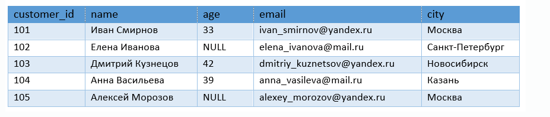
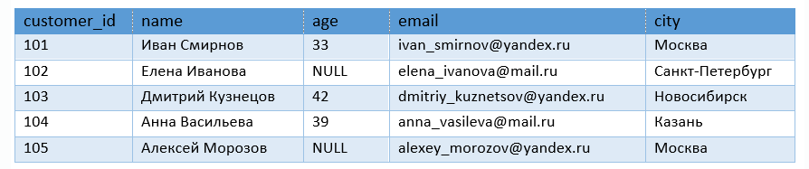
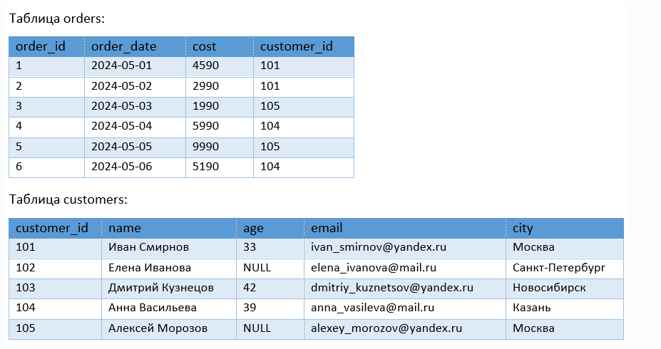
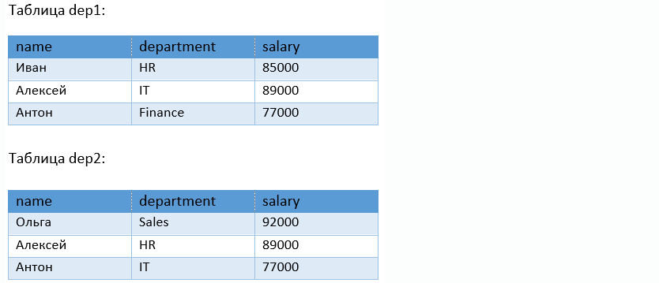

К какому типу СУБД относится PostgreSQL?

Выберите один ответ:
Документо-ориентированная
Реляционная
Сетевая
Иерархическая
Все остальные ответы неверны

Какие объекты у каждой базы данных свои?
Выберите несколько ответов:
Таблицы
Представления
Роли (пользователи и группы)
Схемы
Табличные пространства

Что такое "кластер" в PostgreSQL?

Выберите один ответ:
Совокупность всех таблиц в базе данных
Совокупность всех серверов организации
Совокупность всех баз данных на данном сервере
Совокупность всех пользователей базы данных
Все остальные ответы неверны

Какое поле называется "полем первичного ключа"?

Выберите один ответ:
Поле, значения которого не повторяются в различных строках
Поле, значение которого не может быть NULL
Поле, по которому создан индекс
Поле, специально предназначенное для того, чтобы отличать по его значению одну строку в таблице от другой
Все остальные ответы неверны

Можно ли создать таблицы следующими командами?

CREATE TABLE categories 
               (
                 id INTEGER GENERATED ALWAYS AS IDENTITY PRIMARY KEY,
                 category_name VARCHAR(255) NOT NULL
                );

CREATE TABLE products
               (
                 product_name VARCHAR(255) NOT NULL,
                 price DECIMAL(10, 2) NOT NULL,
                 category_id INT,
                 FOREIGN KEY (category_id) REFERENCES categories(id)
                );
Выберите один ответ:
Да, можно
Нет, так как в таблице products отсутствует первичный ключ, а создать таблицу без первичного ключа нельзя
Нет, так как в таблице products не может быть внешних ключей
Нет, так как имена полей первичного и внешнего ключей двух таблиц должны совпадать
Все остальные ответы неверны

Таблица создана следующей командой.

CREATE TABLE customers 
              (
               customer_id INT PRIMARY KEY,
               name VARCHAR(100) NOT NULL,
               age INT,
               email VARCHAR(100) UNIQUE,
               city VARCHAR(50) NOT NULL
               );

Какое поле этой таблицы является полем внешнего ключа?
Выберите один ответ:
customer_id
name
email
city
В этой таблице нет внешнего ключа
Такую таблицу создать невозможно
Все остальные ответы неверны

Какие типы данных присутствуют в PostgreSQL?

Выберите несколько ответов:
integer
double precision
datetime
text
object
varchar

Какая команда служит для создания таблицы?

Выберите один ответ:
CREATE DATABASE
CREATE TABLE
CREATE INDEX
INSERT INTO
Все остальные ответы неверны

кая команда используется для того, чтобы вставить новую колонку в ранее созданную таблицу?

Выберите один ответ:
ALTER TABLE
CREATE TABLE
INSERT INTO
CREATE COLUMN
Все остальные ответы неверны

Какой тип данных целесообразно использовать для хранения в базе данных значений денежных сумм?

Выберите один ответ:
int
float
text
numeric
Все остальные ответы неверны

Таблица создана следующей командой.

CREATE TABLE customers 
              (
               customer_id INT PRIMARY KEY,
               name VARCHAR(100) NOT NULL,
               age INT,
               email VARCHAR(100) UNIQUE,
               city VARCHAR(50) NOT NULL
               );

Какое поле этой таблицы является полем первичного ключа?
Выберите один ответ:
customer_id
name
email
city
В этой таблице нет первичного ключа
Такую таблицу создать невозможно
Все остальные ответы неверны

Какое количество строк вернет запрос из таблицы customers?

SELECT name, age, email
FROM customers 
WHERE age != 33;

Выберите один ответ:
4
2
0
Все остальные ответы неверны

Какое количество строк вернет запрос из таблицы customers?

SELECT name, age, email
FROM customers 
WHERE age = NULL;

Выберите один ответ:
2
Запрос вернет все строки
0
Будет ошибка т.к. с NULL нельзя сравнивать

Таблицы созданы следующими командами.

CREATE TABLE categories 
               (
                 id serial PRIMARY KEY,
                 category_name VARCHAR(255) NOT NULL
                );

CREATE TABLE products
               (
                 id serial PRIMARY KEY,
                 product_name VARCHAR(255) NOT NULL,
                 price DECIMAL(10, 2) NOT NULL,
                 category_id INT,
                 FOREIGN KEY (category_id) REFERENCES categories(id)
                );

Какой запрос выведет список категорий с указанием максимальной стоимости товара в каждой категории в порядке убывания максимальной стоимости? 
(Наименование категории выводить не требуется)
Выберите один ответ:
WITH tk AS(
         SELECT c.id, MAX(t.price) as max_price
         FROM categories c
         INNER JOIN products p on c.id = p.category_id
         GROUP BY c.id) 
SELECT id, max_price
FROM tk
ORDER BY max_price desc;
SELECT c.id, MAX(p.price) as max_price
FROM categories as c
INNER JOIN products as p on c.id = p.category_id
ORDER BY p.price desc;
SELECT category_id 
FROM products
WHERE price = MAX(price);
Все остальные ответы неверны

Даны таблицы: customers и orders.

Какой запрос выведет уникальные имена-фамилии покупателей, стоимость заказов которых выше средней стоимости по всем заказам?

Выберите один ответ:
SELECT c.name
FROM customers c
JOIN orders o ON c.customer_id = o.customer_id
WHERE o.cost > (SELECT AVG(cost) FROM orders); 
SELECT DISTINCT c.name
FROM customers c
JOIN orders o ON c.customer_id = o.customer_id
HAVING o.cost > AVG(cost); 
SELECT c.name
FROM customers c
JOIN orders o ON c.customer_id = o.customer_id
WHERE o.cost > (SELECT AVG(cost) FROM orders)
GROUP BY c.name; 
SELECT DISTINCT c.name
FROM customers c
JOIN orders o ON c.customer_id = o.customer_id
HAVING o.cost > (SELECT AVG(cost) FROM orders); 
Все остальные ответы неверны

