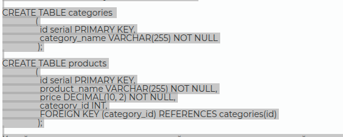

# Тесты от `Specialist`

## Вопрос 1 Что делает следующий код в PL/pgSQL?

```sql
FOREACH i IN ARRAY a42 LOOP RAISE LOG '%', i; END LOOP;
```

Выберите один ответ:

- Устанавливает одинаковое значение i для каждого элемента массива a42.
- + Выводит каждый элемент массива a42 в журнале сообщений сервера
- Получает сумму всех элементов массива a42 и записывает ее в переменную i.
- Итерирует по элементам массива a42, увеличивая каждый из них на единицу.

## Вопрос 2 Какая команда применяется для инициирования ручной очистки всех таблиц базы данных?

Выберите один ответ:

- CLEAN DATABASE
- - VACUUM
- DB_CLEAN
- SWEEP

## Вопрос 3 Какая команда используется для перечитывания конфигурационных файлов без перезапуска сервера?

Выберите один ответ:

- RELOAD POSTGRESQL
- - SELECT pg_reload_conf();
- UPDATE pg_configuration SET reload = true;
- RESTART CONFIGURATION

## Вопрос 4 Какое значение вернет функция?


Выберите один ответ:

- 20
- 22
- - 43
- 42

## Вопрос 5 В какой секции PL/pgSQL обрабатываются исключения?

Выберите один ответ:

- BEGIN
- LOOP
- EXECUTE
- - EXCEPTION
- CATCH

## Вопрос 6 В каком месте хранятся данные системной таблицы pg_database?

Выберите один ответ:

- - pg_global
- pg_default
- pg_system
- pg_catalog
- pg_internal

## Вопрос 7 Какие недостатки связаны с использованием динамических SQL команд в подпрограммах?

Выберите один ответ:

- Увеличение скорости выполнения запросов
- - Потенциальная уязвимость для SQL-инъекций
- Игнорирование ограничения по количеству символов в динамических запросах
- Недоступность использования переменных в динамических SQL командах
- Требуется обязательная компиляция динамических SQL запросов.

Это подтверждается тем, что:

SQL-инъекции являются классической проблемой динамического SQL

Динамический SQL особенно уязвим, когда пользователь передает некорректные или злонамеренные данные

Остальные варианты либо неверны, либо даже являются преимуществами динамического SQL:

Скорость выполнения может даже снижаться из-за проблем с кешированием планов

Ограничения по количеству символов не игнорируются

Переменные можно и нужно использовать в динамических запросах

Компиляция не является обязательным требованием

Поэтому главным недостатком является именно уязвимость к SQL-инъекциям, которую необходимо специально предотвращать правильным использованием инструментов экранирования (например, через FORMAT с %I и %L).

## Вопрос 8 Какая команда служит для отключения режима выравнивания в psql?

Выберите один ответ:

- \p
- - \a
- \h
- \t

Это подтверждается следующим:

Команда \a является переключателем режима выравнивания вывода

Она может включать и выключать выравнивание результатов

\p - это команда для отображения текущего запроса

\h - это команда для получения справки по SQL командам

\t - это команда для включения/выключения отображения заголовков и итоговой строки

Таким образом, именно команда \a отвечает за управление режимом выравнивания вывода в psql.

## Вопрос 9 В режиме изоляции READ COMMITED когда происходит построение снимка данных?

Выберите один ответ:

- Перед началом каждой транзакции
- Перед каждым запросом к таблице
- В момент начала каждой транзакции
- В момент начала чтения каждой строки данных
- - При выполнении каждого оператора транзакции

Это подтверждается тем, что в режиме READ COMMITTED:

Каждый SQL-оператор получает свежий снимок данных

Снимки создаются заново для каждого нового оператора

Это обеспечивает видимость только тех изменений, которые были зафиксированы к моменту выполнения конкретного оператора

В отличие от других режимов изоляции, где снимок может создаваться один раз для всей транзакции

Остальные варианты неверны:

“Перед началом каждой транзакции” - неверно, так как в READ COMMITTED снимок создается чаще

“Перед каждым запросом к таблице” - некорректная формулировка

“В момент начала каждой транзакции” - неверно для READ COMMITTED

“В момент начала чтения каждой строки данных” - слишком часто и не соответствует механизму работы

Таким образом, именно выполнение каждого оператора является триггером для создания нового снимка данных в режиме READ COMMITTED.

## Вопрос 10 Какой способ можно использовать для удаления базы данных с отключением всех клиентов?

Выберите один ответ:

- - DROP DATABASE D1 WITH (FORCE);
- DROP DATABASE IF EXISTS D1;
- ALTER DATABASE D1 SET SINGLE_USER WITH ROLLBACK IMMEDIATE; DROP DATABASE D1;
- Использовать команду KILL для отключения клиентов, а затем удалить базу данных;
- Переименовать базу данных, создать новую и скопировать данные.

Это подтверждается следующими фактами:

Опция WITH (FORCE) специально предназначена для “силового” удаления базы данных

Она доступна начиная с PostgreSQL версии 13

Автоматически принудительно закрывает все активные сеансы

Позволяет выполнить удаление даже при подключенных клиентах

Остальные варианты неверны:

DROP DATABASE IF EXISTS D1 только проверяет существование БД, но не отключает клиентов

ALTER DATABASE … SET SINGLE_USER требует дополнительных действий

Использование KILL требует ручного отслеживания всех подключений

Переименование и копирование - это сложный и избыточный способ, который не гарантирует корректного удаления

Таким образом, DROP DATABASE WITH (FORCE) является наиболее эффективным и безопасным способом удаления базы данных с автоматическим отключением всех клиентов.

## Вопрос 11 Какие шаги необходимо предпринять для создания триггеров для обработки команды MERGE?

Выберите один ответ:

- - Создать триггеры для вставки, обновления и удаления данных
- Использовать выражение CASE для обработки команды MERGE внутри триггера
- Использовать механизм транзакций для согласованности данных при выполнении MERGE
- Разработать хранимую процедуру для реализации функциональности MERGE

Это подтверждается следующими фактами:

Команда MERGE фактически объединяет в себе операции INSERT, UPDATE и DELETE

Для обработки MERGE необходимо создать триггеры для каждой из этих операций

Это позволяет корректно обрабатывать все аспекты команды MERGE

Остальные варианты неверны:

Использование CASE внутри триггера не является правильным подходом для обработки MERGE

Механизм транзакций важен для согласованности, но это не специфический шаг для создания триггеров

Разрабатывание хранимой процедуры не является необходимым для обработки MERGE через триггеры

Таким образом, для корректной обработки команды MERGE через триггеры необходимо создать отдельные триггеры для операций вставки, обновления и удаления данных.

## Вопрос 12 Какая команда используется для получения информации о текущем подключении в psql?

Выберите один ответ:

- \cinfo
- \conn
- \connect
- - \conninfo

Это подтверждается следующими фактами:

Команда \conninfo специально предназначена для вывода информации о текущем подключении

Она показывает детали подключения, такие как:

имя базы данных

имя пользователя

способ подключения (через сокет или сеть)

номер порта

Остальные варианты неверны:

\cinfo - такой команды не существует

\conn - такой команды не существует

\connect (или \c) используется для установления нового подключения, а не для получения информации о текущем

Например, вывод команды может выглядеть так:

You are connected to database "student" as user "student" via socket in "/var/run/postgresql" at port "5432

## Вопрос 13 Каким образом можно заполнить одномерный массив в PL/pgSQL?

Выберите один ответ:

- + С помощью оператора ARRAY
- Используя функцию CREATEARRAY()
- При помощи ключевого слова FILLARRAY()
- Через использование оператора INSERT INTO

Правильный ответ: С помощью оператора ARRAY

В PL/pgSQL для создания массива используется синтаксис ARRAY[]

Пример использования: ARRAY[1,2,3,4]

Это стандартный и рекомендуемый способ создания массивов

Остальные варианты неверны:

Функции CREATEARRAY() не существует в PL/pgSQL

Ключевого слова FILLARRAY() также не существует

Оператор INSERT INTO используется для вставки данных в таблицы, а не для создания массивов

Дополнительно стоит отметить, что можно использовать и другой способ записи - через фигурные скобки: '{значение1,значение2,значение3}'

Пример создания одномерного массива в PL/pgSQL:

```sql
DECLARE
  my_array integer[];
BEGIN
  my_array := ARRAY[10, 20, 30, 40];
  -- или альтернативный способ
  my_array := '{10,20,30,40}';
END;
```

## Вопрос 14 Какие типы изменчивости функций используются в PL/pgSQL?

Выберите несколько ответов:

* + STABLE
* + IMMUTABLE
* CALLED ONCE
* + VOLATILE
* LEAKPROOF
* CALM


Это подтверждается следующими фактами:

VOLATILE - функция может возвращать разные результаты при одинаковых аргументах и может модифицировать базу данных

STABLE - функция гарантирует одинаковый результат при одинаковых аргументах в рамках одного оператора и не может модифицировать базу данных

IMMUTABLE - функция всегда возвращает одинаковый результат при одинаковых аргументах и не может модифицировать базу данных


## Вопрос 15 Опишите процедуру передачи курсора клиенту в PL/pgSQL. Какие шаги включены в этот процесс и каковы его потенциальные применения?

Выберите один ответ:

* Курсоры не могут быть переданы клиенту; они всегда используются исключительно внутри сервера для управления данными.
* Курсор открывается в PL/pgSQL и передается клиенту только для чтения данных, без возможности выполнения операций записи или обновления.
* Клиент может выполнять операции чтения курсора, но не управление транзакциями.
* + Функция на PL/pgSQL открывает курсор и возвращает его имя клиенту, который может управлять данными курсора, включая чтение и обновление


Это подтверждается следующими фактами:

PL/pgSQL позволяет создавать функции, которые:

Открывают курсор

Возвращают его идентификатор

Клиент может работать с этим курсором

Клиент может выполнять:

Операции чтения

Операции обновления данных через курсор

Управление перемещением по набору данных

Потенциальные применения:

Обработка больших наборов данных
Последовательная обработка записей
Интерактивное взаимодействие с базой данных
Обновление данных построчно
Пример реализации:

```SQL
CREATE FUNCTION get_cursor() RETURNS refcursor AS $$
DECLARE
    my_cursor refcursor;
BEGIN
    OPEN my_cursor FOR SELECT * FROM my_table;
    RETURN my_cursor;
END;
$$ LANGUAGE plpgsql;

--После получения курсора клиент может выполнять:

FETCH FROM get_cursor();
UPDATE my_table SET column = value WHERE CURRENT OF get_cursor;
```

Такой подход особенно полезен при работе с большими наборами данных, когда необходимо:

Обрабатывать данные порциями

Выполнять сложные операции обновления

Обеспечивать последовательный доступ к данным


## Вопрос 16 Какой уровень изоляции гарантирует, что каждый последующий запрос в транзакции будет видеть данные, согласованные на момент начала транзакции?

Выберите один ответ:

* Read Uncommitted
* Read Committed
* Serializable
* + Repeatable Read


Это подтверждается следующими фактами:

Repeatable Read гарантирует, что:

Транзакция видит “снимок” данных на момент начала транзакции

Все запросы внутри транзакции видят одни и те же данные

Данные остаются согласованными на момент начала транзакции

Пример работы Repeatable Read:
```SQL
-- Сессия 1 (Repeatable Read)
BEGIN TRANSACTION ISOLATION LEVEL REPEATABLE READ;
SELECT balance FROM bank_accounts WHERE id = 1; -- Предположим, баланс 1000

-- В это время другая сессия меняет данные
-- Сессия 2
UPDATE bank_accounts SET balance = balance + 500 WHERE id = 1;
COMMIT;

-- Но в первой сессии мы всё ещё видим старое значение
-- Сессия 1
SELECT balance FROM bank_accounts WHERE id = 1; -- Всё еще видит 1000
COMMIT;
```

Другие варианты неверны, потому что:

Read Uncommitted видит незафиксированные изменения других транзакций
Read Committed может видеть новые изменения после каждого запроса
Serializable хотя и обеспечивает строгую изоляцию, но фокусируется на последовательном выполнении транзакций, а не на согласованности данных на момент начала
Этот уровень изоляции особенно важен для:

Операций, требующих согласованности данных
Сложных аналитических запросов
Процедур, где важна целостность данных на протяжении всей транзакции


## Вопрос 17 Какой из следующих уровней изоляции не поддерживается в PostgreSQL?

Выберите один ответ:

* READ COMMITTED
* REPEATABLE READ
* SERIALIZABLE
* + READ UNCOMMITTED


Это подтверждается следующими фактами:

В PostgreSQL поддерживаются только три уровня изоляции:

READ COMMITTED (уровень по умолчанию)

REPEATABLE READ

SERIALIZABLE

READ UNCOMMITTED намеренно не реализован в PostgreSQL, потому что:

Он может привести к чтению “грязных” данных

Создает риски для целостности данных

Не соответствует философии надежности PostgreSQL

PostgreSQL обеспечивает:

Безопасное чтение только подтвержденных данных

Консистентность данных при повторном чтении (REPEATABLE READ)

Полную сериализуемость операций (SERIALIZABLE)

Это важное отличие PostgreSQL от других СУБД, где READ UNCOMMITTED может быть доступен как самый слабый уровень изоляции.

Пример установки уровня изоляции в PostgreSQL:

BEGIN ISOLATION LEVEL REPEATABLE READ;
-- или
SET TRANSACTION ISOLATION LEVEL SERIALIZABLE;

READ UNCOMMITTED часто используется в системах, где требуется максимальная производительность ценой потенциальной несогласованности данных, но такой компромисс противоречит философии PostgreSQL, ориентированной на надежность и целостность данных.


## Вопрос 18 Как можно подключиться к базе данных template1 сразу после установки и инициализации кластера БД от имени обычного пользователя?

Выберите один ответ:

* psql template1
* + sudo psql -d template1
* useradd -d template1 -U postgres
* psql -c 'CREATE DATABASE test' template1

Это подтверждается следующими фактами:

Сразу после установки кластера БД:

Только пользователь postgres или root имеют доступ к базе template1

Обычный пользователь не имеет прав на доступ к template1

Команда sudo psql -d template1:

Выполняется с правами суперпользователя

Позволяет подключиться к базе template1

Соответствует требованиям безопасности

Другие варианты неверны, потому что:

psql template1 - не сработает без прав суперпользователя

useradd -d template1 -U postgres - это некорректная команда для подключения

psql -c ‘CREATE DATABASE test’ template1 - попытка создания БД без нужных прав

Важно отметить, что template1 является системной базой данных, которая используется как шаблон для создания новых баз данных. 

Прямой доступ к ней обычно ограничен по соображениям безопасности и целостности данных.

После инициализации кластера рекомендуется создать отдельного пользователя с нужными правами для работы с базами данных, вместо постоянного использования суперпользовательского доступа.


## Вопрос 19 Какие характеристики роли pg_database_owner следует учитывать?

Выберите один ответ:

* В нее можно включить внешнюю учетную запись
* Она не может управлять объектами и получать права доступа
* В нее можно включить другие роли явно
* + Нельзя добавить роль pg_database_owner явно в другую роль

pg_database_owner - это специальная роль в PostgreSQL, которая:

Назначается автоматически при создании базы данных

Содержит владельцев всех баз данных

Является системной встроенной ролью

Особенности роли pg_database_owner:

Не может быть явно добавлена в другие роли

Является группой для всех владельцев баз данных

Предоставляет права на управление базами данных

Почему другие варианты неверны:

Внешнюю учетную запись нельзя включить напрямую

Роль может управлять объектами в рамках своих баз данных

Нельзя явно включать другие роли в pg_database_owner

Практическое применение:

Используется системой для определения владельцев баз данных

Помогает в управлении правами доступа к базам данных

Обеспечивает безопасность через ограничение возможностей

Это важный аспект безопасности PostgreSQL, который помогает контролировать доступ к базам данных и предотвращает случайное или намеренное нарушение целостности системы.

Рекомендуется использовать эту роль только для системных целей и не пытаться модифицировать её состав вручную.


## Вопрос 20 Какую характеристику курсорной переменной в PL/pgSQL нужно учитывать при их объявлении и использовании?


* + Имя курсора должно быть уникальным
* Курсоры не могут использоваться внутри транзакций
* Каждому курсору обязательно нужно задать тип данных
* По умолчанию курсоры открываются в режиме автокоммит
* Курсоры не могут быть объявлены внутри циклов.


Это подтверждается следующими фактами:

Все порталы (курсоры) должны иметь уникальные имена в пределах сессии.

PL/pgSQL автоматически присваивает уникальные имена порталам, если не указано иное.

При присвоении курсорной переменной ненулевого строкового значения, эта строка используется как имя портала.

Другие варианты неверны, потому что:

Курсоры могут использоваться внутри транзакций (на самом деле они автоматически закрываются при завершении транзакции)

Тип данных для курсора всегда один - refcursor

Курсоры не открываются в режиме автокоммит

Курсоры могут быть объявлены внутри циклов

Практическое применение:

```SQL
DECLARE
  curs1 refcursor; -- автоматически получит уникальное имя
  curs2 refcursor; -- должно быть уникальным
BEGIN
  OPEN curs1 FOR SELECT * FROM table;
  -- ...
END;
```
Это важное ограничение для обеспечения корректной работы с курсорами, так как уникальные имена позволяют однозначно идентифицировать каждый портал в рамках сессии.


## Вопрос 21 Как можно сделать составной типа данных?

* + С помощью оператора CREATE TYPE.
* С использованием ключевого слова COMPOSITE
* С помощью ключевого слова STRUCT
* Используя ключевое слово ARRAY
* С использованием функции DEFINE_TYPE
* Используя ключевое слово UNION

Это подтверждается следующими фактами:

Синтаксис создания составного типа данных:
```SQL
CREATE TYPE имя_типа AS (
    поле1 тип_данных,
    поле2 тип_данных
);
Пример создания:
CREATE TYPE product_type AS (
    kod integer,
    name character varying(100)
);


```
Другие варианты неверны, потому что:

COMPOSITE используется как тип в pgAdmin при создании через интерфейс

STRUCT не является ключевым словом в PostgreSQL

ARRAY - это отдельный тип данных, не связанный с составными типами

DEFINE_TYPE не существует в PostgreSQL

UNION используется для объединения результатов запросов
Составной тип данных можно использовать после создания как любой другой тип данных, например, при создании таблиц:

```SQL
CREATE TABLE products (
    id INT PRIMARY KEY,
    type product_type
);

```
Это стандартный и рекомендуемый способ работы с составными типами данных в PostgreSQL.


## Вопрос 22 Какая функция возвращает текущее значение счетчика транзакций?


* + pg_current_xact_id();
* retrieve_current_count()
* counter_clog()
* nextval()
* current_value_xact()

pg_current_xact_id() - это системная функция PostgreSQL, которая:

Возвращает текущий ID транзакции

Возвращает значение типа xid8

Добавлена в PostgreSQL 13

Заменяет функцию txid_current()

Пример использования:

SELECT pg_current_xact_id();

Другие варианты неверны, потому что:

retrieve_current_count() - несуществующая функция

counter_clog() - несуществующая функция

nextval() - функция для работы с последовательностями

current_value_xact() - несуществующая функция

Важно отметить, что если текущая транзакция еще не имеет ID, функция pg_current_xact_id() присвоит новый ID. 

Для получения ID только если он уже назначен, следует использовать pg_current_xact_id_if_assigned().

Эта функция часто используется для:

Отслеживания порядка транзакций

Отладки проблем с параллелизмом

Получения информации о состоянии базы данных


## Вопрос 23 Какая команда может быть использована для загрузки данных из текстового файла в таблицу, если учитывается заголовок данных в файле?


* COPY (TRUE)
* IMPORT (HEADER MATCH)
* LOAD (HEADERS)
* INSERT INTO (HEADER IS TRUE)
* + COPY (HEADER MATCH)


Это подтверждается следующими фактами:

Команда COPY поддерживает параметр HEADER, который указывает, что первая строка файла содержит заголовки столбцов:

COPY my_table FROM '/path/to/file.csv' DELIMITER ',' CSV HEADER;

В синтаксисе COPY есть опция HEADER, которая:

Пропускает первую строку файла

Использует имена столбцов из первой строки

Соответствует заголовкам таблицы

Другие варианты неверны, потому что:


COPY (TRUE) - некорректный синтаксис
IMPORT (HEADER MATCH) - нет такой команды в PostgreSQL
LOAD (HEADERS) - нет такой команды в PostgreSQL
INSERT INTO (HEADER IS TRUE) - некорректный синтаксис

Практический пример использования:
```SQL
-- Создание таблицы
CREATE TABLE employees (
    id serial PRIMARY KEY,
    name text,
    department text
);

-- Загрузка данных из CSV с заголовком
COPY employees FROM '/path/to/employees.csv'
DELIMITER ','
CSV HEADER;
```

Это стандартный и рекомендуемый способ загрузки данных из файлов с заголовками в PostgreSQL.


## Вопрос 24 Какую команду необходимо использовать для создания нового пользователя?

Выберите один ответ:

* + CREATE ROLE
* INSERT USER
* REGISTER USER
* ADD USER
* NEW USER

CREATE ROLE - это стандартная команда PostgreSQL для создания пользователей и ролей:

CREATE ROLE имя_пользователя [WITH параметры];

Команда позволяет задать различные параметры:

LOGIN (право на подключение)

SUPERUSER (права суперпользователя)

CREATEDB (право создавать базы данных)

PASSWORD (пароль пользователя)

Пример создания пользователя:
```SQL
CREATE ROLE new_user WITH
    LOGIN
    PASSWORD 'password'
    CREATEDB
    NOSUPERUSER;
```

Другие варианты неверны, потому что:

INSERT USER - некорректный синтаксис

REGISTER USER - нет такой команды

ADD USER - нет такой команды

NEW USER - нет такой команды

CREATE ROLE является рекомендуемым и единственным корректным способом создания 
пользователей в PostgreSQL. Эта команда также позволяет управлять правами и привилегиями новых пользователей.


## Вопрос 25 Какой уровень изоляции является установленным по умолчанию в PostgreSQL?

Выберите один ответ:

* SERIALIZABLE
* REPEATABLE READ
* * READ COMMITTED
* READ UNCOMMITTED
* AUTOCOMMIT


READ COMMITTED - это уровень изоляции по умолчанию в PostgreSQL
Этот уровень гарантирует, что:

Любая прочитанная данные должна быть уже зафиксирована (committed)
Предотвращаются грязные чтения (dirty reads)

Однако возможны неповторяющиеся чтения (non-repeatable reads) и фантомные чтения (phantom reads)

Пример использования:
```SQL
BEGIN;
SET TRANSACTION ISOLATION LEVEL READ COMMITTED;
SELECT * FROM orders WHERE amount > 100;
COMMIT;
```

Другие варианты неверны, потому что:

READ UNCOMMITTED вообще не поддерживается PostgreSQL

REPEATABLE READ, SERIALIZABLE и AUTOCOMMIT - это другие уровни изоляции, но они не являются уровнями по умолчанию

Важно отметить, что READ COMMITTED обеспечивает хороший баланс между:

Согласованностью данных

Производительностью

Параллелизмом выполнения транзакций

Этот уровень изоляции гарантирует, что даже если другие транзакции модифицируют данные, каждое утверждение внутри вашей транзакции увидит консистентное состояние зафиксированных данных на момент начала выполнения.


## Вопрос 26 Какую конструкцию следует использовать для написания функции в стиле стандарта SQL, содержащей несколько SQL операторов?

Выберите один ответ:

* RETURN
* BEGIN ... END
* USING SQL
* STYLED AS SQL STANDARD
* + BEGIN ATOMIC ... END

Это подтверждается следующими фактами:

Конструкция BEGIN ATOMIC … END:

Соответствует стандарту SQL

Позволяет группировать несколько SQL операторов

Обеспечивает атомарность выполнения блока

Поддерживается в различных СУБД

Пример использования:

```SQL
CREATE FUNCTION my_function()
RETURNS INTEGER
LANGUAGE SQL
BEGIN ATOMIC
    DECLARE var INTEGER;
    SELECT column INTO var FROM my_table;
    RETURN var;
END
```

Другие варианты неверны, потому что:

* RETURN - это только команда для возврата значения из функции

* BEGIN … END - используется в T-SQL, но не соответствует стандарту SQL

* USING SQL - некорректная конструкция

* STYLED AS SQL STANDARD - не существует такой конструкции

Важно отметить, что конструкция BEGIN ATOMIC … END:

Обеспечивает выполнение всех операторов как единой атомарной операции

Поддерживает обработку ошибок

Соответствует стандартам ANSI SQL

Гарантирует, что либо все операторы выполнятся успешно, либо ни один не вступит в силу


## Вопрос 27 Какой параметр позволяет автоматически находить таблицу в нужной схеме при обращении к ней по короткому имени?

Выберите один ответ:

* searchschema
* autoschema
* * searchpath
* schemapath


Это подтверждается следующими фактами:

search_path - это параметр, который определяет путь поиска объектов в PostgreSQL

По умолчанию search_path установлен как:

search_path = "$user", public

При обращении к таблице без указания схемы PostgreSQL:

Сначала ищет таблицу в первой схеме из search_path

Если не находит, ищет во второй схеме

И так далее по порядку

Можно изменить search_path командой:

SET search_path = public, имя_схемы;

Реальный путь поиска можно посмотреть командой:

SELECT current_schemas(true);

Другие варианты неверны, потому что:


searchschema, autoschema и schemapath - это несуществующие параметры в PostgreSQL
Важно отметить, что:

Если схема не существует или у пользователя нет к ней доступа, она будет исключена из пути поиска
Всегда есть неявное добавление схемы pg_catalog в путь поиска
Порядок схем в search_path важен для определения приоритета поиска


## Вопрос 2
На изображении представлены варианты ответа на вопрос о том, какой термин используется для указания раздела переменных в PL/pgSQL. Согласно предоставленной информации, правильный ответ — DECLARE.
```


Каким образом можно ограничить полученные данные с помощью SQL запроса?

Выберите один ответ:
SELECT DISTINCT
FILTER BY
WHERE
LIMIT


Можно ли обратиться к функции, возвращающую скалярное значение как к таблице?

Выберите один ответ:
Да, с помощью ключевого слова EXECUTE
Нет, это невозможно
Да, с использованием ключевого слова CALL
Да, это возможно если обратиться к функции в предложении FROM
Нет, только таблицы можно запрашивать через SELECT


Функция вернет значение 'world'.

Это происходит потому, что в теле функции f1 выполняется запрос SELECT 'Hello ', 'world', который возвращает два значения: 'Hello ' и 'world'. Поскольку функция объявлена как возвращающая text, она вернет второе значение из списка, то есть 'world'.


Какая часть блока кода на языке PL/pgSQL является необходимой?

Выберите один ответ:
DECLARE
BEGIN..END
EXCEPTION
PRINT


Что произойдет при выполнении данного блока кода?


Выберите один ответ:
Будет выведено сообщение "На ноль делить нельзя"
Произойдет ошибка синтаксиса
Программа завершится с исключением division by zero
Будет выведено сообщение "Все в порядке"
При выполнении данного блока кода произойдет ошибка деления на ноль, так как в нем выполняется операция 1 / 0. В результате будет выведено сообщение “На ноль делить нельзя”.


Какие опции утилиты pg_dump позволяют выбирать объекты для восстановления из выходного файла? Выберите несколько вариантов.

Выберите несколько ответов:
-t, --table=TABLENAME
-F, --format=format
-T, --exclude-table=TABLENAME
-n, --schema=SCHEMANAME
-a, --data-only
Опции утилиты pg_dump, которые позволяют выбирать объекты для восстановления из выходного файла, это:

-t, --table=TABLENAME: позволяет выбрать таблицы для включения в дамп.
-n, --schema=SCHEMANAME: позволяет выбрать схемы для включения в дамп.
Эти опции позволяют указать, какие именно объекты должны быть включены в создаваемый дамп базы данных.


Какое отличие между функцией и процедурой?

Выберите один ответ:
Функция может возвращать значение, процедура не может
Процедура может выполнять DML операции напрямую, функция не может
Функция должна всегда возвращать значение, процедура может не возвращать
Процедура может вызывать другие процедуры, функция не может
Функции легче использовать в SQL запросах, чем процедуры.
Основное отличие между функцией и процедурой заключается в том, что функция должна всегда возвращать значение, в то время как процедура может не возвращать никакого значения вообще.

Это ключевое различие, потому что:

Функции предназначены для вычислений и возврата результата
Процедуры предназначены для выполнения последовательности действий, которые могут как возвращать значение, так и не возвращать ничего
В функциях обязательно должен быть указан тип возвращаемого значения
Процедуры могут выполнять различные операции без необходимости что-либо возвращать
Остальные варианты ответов либо неточны, либо неверны, так как:

И функции, и процедуры могут выполнять DML операции
И те, и другие могут вызывать друг друга
Удобство использования в SQL запросах зависит от конкретной СУБД и реализации


Оператор EXECUTE целесообразно применять при необходимости выполнения динамических SQL запросов.

Это правильный ответ, потому что:

EXECUTE предназначен именно для выполнения динамических SQL-запросов, которые формируются во время выполнения программы
Динамические запросы позволяют:
Формировать SQL на основе входных параметров
Выполнять различные типы запросов в зависимости от условий
Создавать гибкие решения для работы с данными
Остальные варианты неверны, так как:

Создание новых таблиц, управление пользователями и правами доступа, выполнение транзакций - это отдельные операции, которые не требуют использования EXECUTE
Определение типов данных в хранимых процедурах также выполняется другими способами
EXECUTE является мощным инструментом для выполнения динамических запросов, когда структура запроса заранее неизвестна или может меняться в зависимости от условий выполнения программы.


При синхронном режиме записи WAL, будет ли обеспечено полное восстановление данных после сбоя?

Выберите один ответ:
Да, гарантировано
Нет, никаких гарантий
Зависит от размера базы данных
Только частичное восстановление
Восстановление происходит только при повторном запуске
При синхронном режиме записи WAL полное восстановление данных после сбоя гарантировано.

Это объясняется тем, что в синхронном режиме:

Каждая запись WAL полностью сохраняется на диск перед подтверждением транзакции
Система не сообщает о успешном завершении транзакции, пока все изменения не будут надежно записаны
Это обеспечивает максимальную устойчивость к сбоям
В отличие от:

Асинхронного режима, где могут быть потери данных
Частичного восстановления, которое не является гарантированным
Зависимости от размера базы данных
Необходимости повторного запуска системы
Таким образом, именно синхронный режим записи WAL обеспечивает максимальную надежность и гарантированное восстановление данных после сбоя.


Какой тип триггера лучше всего использовать для автоматического заполнения поля при вставке строки через сложное представление?

Выберите один ответ:
BEFORE STATEMENT
BEFORE ROW
INSTEAD OF ROW
AFTER ROW
AFTER TRIGGER
Для автоматического заполнения поля при вставке строки через сложное представление лучше всего использовать тип триггера INSTEAD OF ROW.

Это объясняется следующими причинами:

INSTEAD OF триггеры специально предназначены для работы с представлениями (views)
Они позволяют определить альтернативные действия, которые выполняются вместо стандартной операции INSERT
ROW уровень необходим, так как INSTEAD OF триггеры всегда должны быть определены как FOR EACH ROW
Такой триггер может обрабатывать логику заполнения полей до выполнения фактической вставки
Остальные варианты менее подходят, потому что:

BEFORE/AFTER STATEMENT срабатывают один раз для всей операции, а не для каждой строки
BEFORE/AFTER ROW триггеры не могут изменять данные при работе с представлениями
AFTER триггеры срабатывают уже после выполнения операции, что не подходит для автоматического заполнения полей
INSTEAD OF ROW - это именно тот тип триггера, который предназначен для обработки вставок в представления и позволяет реализовать логику автоматического заполнения полей.


Какие из перечисленных операций являются частью механизма транзакций?

Выберите один ответ:
Исполнение и переписывание запросов.
Разбор и планирование запросов.
Фиксация (COMMIT) и откат (ROLLBACK) изменений.
Подключение и аутентификация клиентов.
Правильный ответ: Фиксация (COMMIT) и откат (ROLLBACK) изменений.

Это подтверждается тем, что:

Фиксация (COMMIT) и откат (ROLLBACK) являются фундаментальными операциями механизма транзакций
Они определяют окончание транзакции: либо успешное завершение (COMMIT), либо отмена всех изменений (ROLLBACK)
Именно эти операции обеспечивают одно из ключевых свойств транзакций - атомарность (либо всё выполнено, либо ничего)
Остальные варианты не являются частью механизма транзакций, так как:

Исполнение и переписывание запросов - это часть обработки SQL-запросов
Разбор и планирование запросов - это этапы подготовки запроса к выполнению
Подключение и аутентификация клиентов - это процессы управления сессией, которые происходят до начала транзакций
COMMIT и ROLLBACK являются операциями, которые непосредственно управляют состоянием транзакции и определяют её конечный результат.


акая ошибка возникнет при выполнении данного кода?


Выберите один ответ:
Синтаксическая ошибка
Ошибка при объявлении переменной i
Нет ошибок, код выполнится успешно
Ошибка при вызове RAISE NOTICE
Ошибка при объявлении переменной i


Какие данные получает триггерная функция на каждую строку до выполнения операции UPDATE?

Выберите один ответ:
Старые данные (OLD)
Новые данные (NEW)
Данные транзакции (TRANSACTION)
Старые данные и новые данные (OLD, NEW)
Данные изменений (CHANGES)
Триггерная функция на каждую строку до выполнения операции UPDATE получает старые данные (OLD).


Таблицы созданы следующими командами.

CREATE TABLE categories 
               (
                 id INTEGER GENERATED ALWAYS AS IDENTITY PRIMARY KEY,
                 category_name VARCHAR(255) NOT NULL
                );

CREATE TABLE products
               (
                 id INTEGER GENERATED ALWAYS AS IDENTITY PRIMARY KEY,
                 product_name VARCHAR(255) NOT NULL,
                 price DECIMAL(10, 2) NOT NULL,
                 category_id INT,
                 FOREIGN KEY (category_id) REFERENCES categories(id)
                );

Каким запросом можно получить названия всех товаров, их цен и названия категорий, к которым они относятся для товаров, стоимостью менее 100 рублей?
Выберите один ответ:
SELECT product_name, price, category_name
FROM categories c 
JOIN products p ON c.id = p.id 
WHERE price < 100;
SELECT product_name, price, category_name
FROM categories c 
JOIN products p ON c.id = p.category_id 
WHERE price < 100;
SELECT product_name, price, category_name
FROM categories c 
JOIN products p ON c.id = p.category_id
HAVING price < 100;
SELECT product_name, price, category_name
FROM categories c, products p 
WHERE c.id = p.id and price <= 100;
Все остальные ответы неверны





Таблицы созданы следующими командами.

CREATE TABLE categories 
               (
                 id serial PRIMARY KEY,
                 category_name VARCHAR(255) NOT NULL
                );

CREATE TABLE products
               (
                 id serial PRIMARY KEY,
                 product_name VARCHAR(255) NOT NULL,
                 price DECIMAL(10, 2) NOT NULL,
                 category_id INT,
                 FOREIGN KEY (category_id) REFERENCES categories(id)
                );

Какой запрос выведет список категорий с указанием максимальной стоимости товара в каждой категории в порядке убывания максимальной стоимости? 
(Наименование категории выводить не требуется)
Выберите один ответ:
WITH tk AS(
         SELECT c.id, MAX(t.price) as max_price
         FROM categories c
         INNER JOIN products p on c.id = p.category_id
         GROUP BY c.id) 
SELECT id, max_price
FROM tk
ORDER BY max_price desc;
SELECT c.id, MAX(p.price) as max_price
FROM categories as c
INNER JOIN products as p on c.id = p.category_id
ORDER BY p.price desc;
SELECT category_id 
FROM products
WHERE price = MAX(price);
Все остальные ответы неверны


Даны две таблицы: dep1 и dep2. Какое количество строк вернет следующий запрос в результате?

SELECT name, salary
FROM dep1
UNION
SELECT name, salary
FROM dep2;

Выберите один ответ:
5
6
4
3
Все остальные ответы неверны


Даны две таблицы t1 и t2, которые соединяются по полям t1.id = t2.id. Таблицы не пустые, в каждой есть строки и значения в соответствующих полях.
При каком типе соединения в результате может оказаться 0 строк?
Выберите один ответ:
LEFT JOIN
FULL JOIN
CROSS JOIN
INNER JOIN
При любом типе соединения в результате будет больше одной строки
При типе соединения LEFT JOIN в результате может оказаться 0 строк, если для левой таблицы не найдено соответствий в правой таблице.


Даны две таблицы: customers и orders.

Какие запросы выведут имена всех покупателей, не купивших ни одного товара?

Выберите несколько ответов:
SELECT name, email
FROM customers c
LEFT JOIN orders o ON c.customer_id = o.customer_id
WHERE o.order_id IS NULL;
SELECT name, email
FROM customers
WHERE customer_id NOT IN (SELECT customer_id FROM orders);
SELECT name, email
FROM customers c
INNER JOIN orders o ON c.customer_id = o.customer_id
WHERE o.order_id IS NULL;
SELECT name, email
FROM customers
WHERE customer_id <> (SELECT customer_id FROM orders);
SELECT name, email
FROM customers c, orders o
WHERE c.customer_id = o.customer_id
AND o.order_id IS NULL;
Для вывода имён всех покупателей, не купивших ни одного товара, можно использовать следующий запрос:

SELECT name, email 
FROM customers
WHERE customer_id NOT IN (SELECT customer_id FROM orders);
Этот запрос выбирает имена и электронные адреса из таблицы customers, где идентификатор клиента не присутствует в таблице orders.

еще поищи правильные варианты
Правильные варианты запроса для вывода имён всех покупателей, не купивших ни одного товара:

SELECT name, email FROM customers c LEFT JOIN orders o ON c.customer_id = o.customer_id WHERE o.order_id IS NULL;
Этот запрос использует LEFT JOIN, чтобы включить всех покупателей из таблицы customers, даже если у них нет заказов. Условие o.order_id IS NULL отфильтровывает покупателей, у которых есть заказы.
SELECT name, email FROM customers WHERE customer_id NOT IN (SELECT customer_id FROM orders);
Этот запрос использует NOT IN для исключения покупателей, у которых есть заказы в таблице orders.
Остальные варианты:

SELECT name, email FROM customers c INNER JOIN orders o ON c.customer_id = o.customer_id WHERE o.order_id IS NULL; — не подходит, так как INNER JOIN исключает покупателей без заказов.
SELECT name, email FROM customers WHERE customer_id <> (SELECT customer_id FROM orders); — не подходит, так как <> исключает покупателей, у которых есть заказы.
SELECT name, email FROM customers c, orders o WHERE c.customer_id = o.customer_id AND o.order_id IS NULL; — не подходит, так как это устаревший синтаксис JOIN, который может привести к ошибкам.
Если у вас есть дополнительные вопросы или нужно что-то уточнить, дайте знать!


Даны две таблицы: dep1 и dep2. Утверждается, что следующие два запроса вернут одинаковое количество строк.

Запрос № 1:

SELECT name, salary
FROM dep1
UNION ALL 
SELECT name, salary
FROM dep2;

Запрос № 2:

SELECT *
FROM dep1
UNION 
SELECT *
FROM dep2;

Так ли это?

Выберите один ответ:
* Да, оба запроса вернут одинаковое количество строк
Нет, первый запрос вернет меньше строк, чем второй
Нет, второй запрос вернет меньше строк, чем первый
Все остальные ответы неверны
Второй запрос не сработает и будет ошибка


Таблица создана следующей командой.

CREATE TABLE sales.customers
(
customer_id serial PRIMARY KEY,
name VARCHAR(100) NOT NULL,
age INT,
email VARCHAR(100) UNIQUE,
city VARCHAR(50) NOT NULL
);

При выполнении следующей команды:

INSERT INTO customers (name, city)
VALUES ( 'Ольга Иванова', 'Екатеринбург');

выдается ошибка "relation does not exist". В чем может быть причина?
Выберите один ответ:
Не указано имя схемы и не настроен параметр search_path
Таблица имеет другое имя
Покупатель не зарегистрирован как пользователь операционной системы
У пользователя не хватает прав на вставку записей в таблицу
Все остальные ответы неверны
Ошибка “relation does not exist” может возникать по нескольким причинам. В данном случае наиболее вероятная причина — это то, что не указано имя схемы и не настроен параметр search_path.

В PostgreSQL (и других СУБД) по умолчанию поиск объектов (таблиц, функций и т.д.) происходит в текущей схеме. Если вы создаете таблицу в схеме sales, но не указываете эту схему в запросе на вставку данных, PostgreSQL будет искать таблицу в текущей схеме, которая может быть другой.

Чтобы исправить это, вы можете:

Указать схему в запросе:
INSERT INTO sales.customers (name, city)
VALUES ( 'Ольга Иванова', 'Екатеринбург');


# PS


```bash
sudo -u postgres psql
```